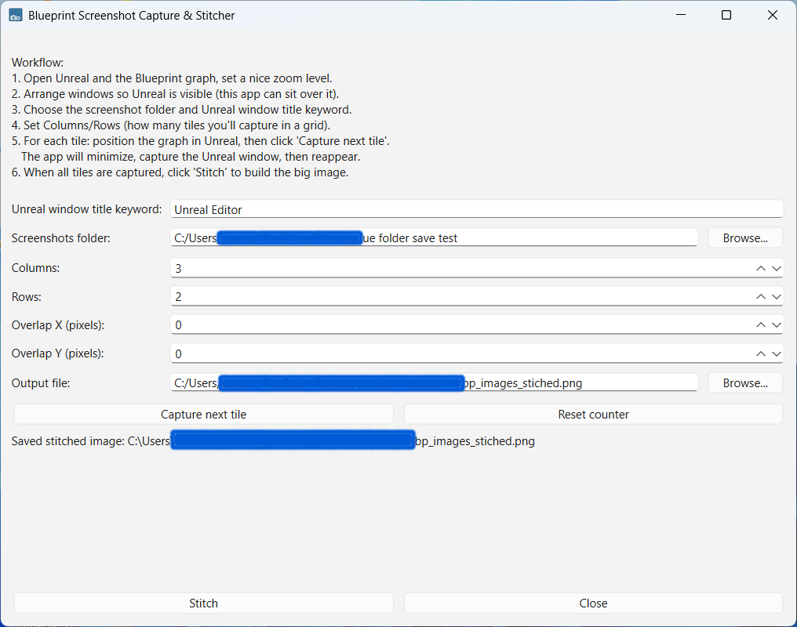
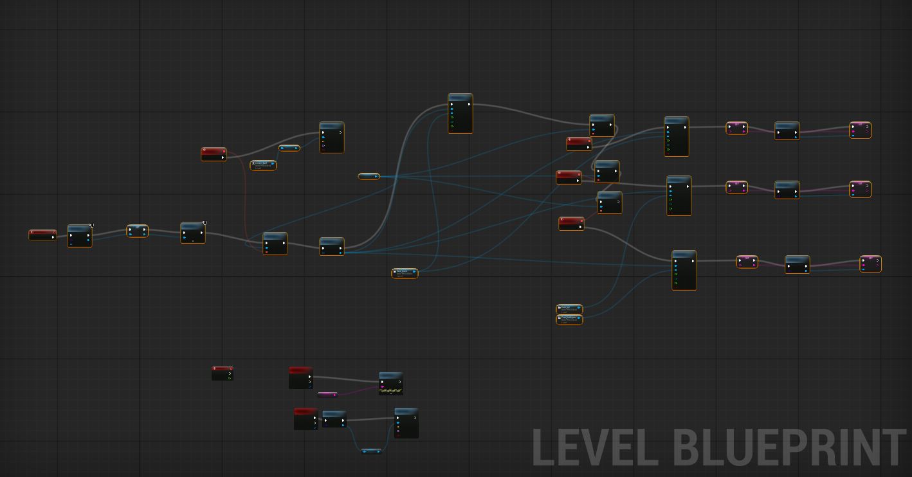
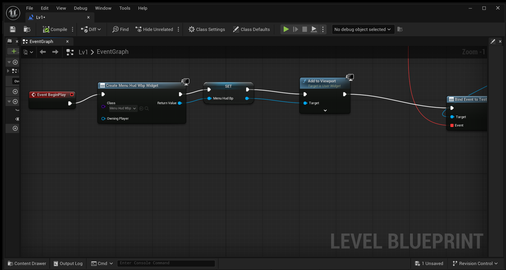
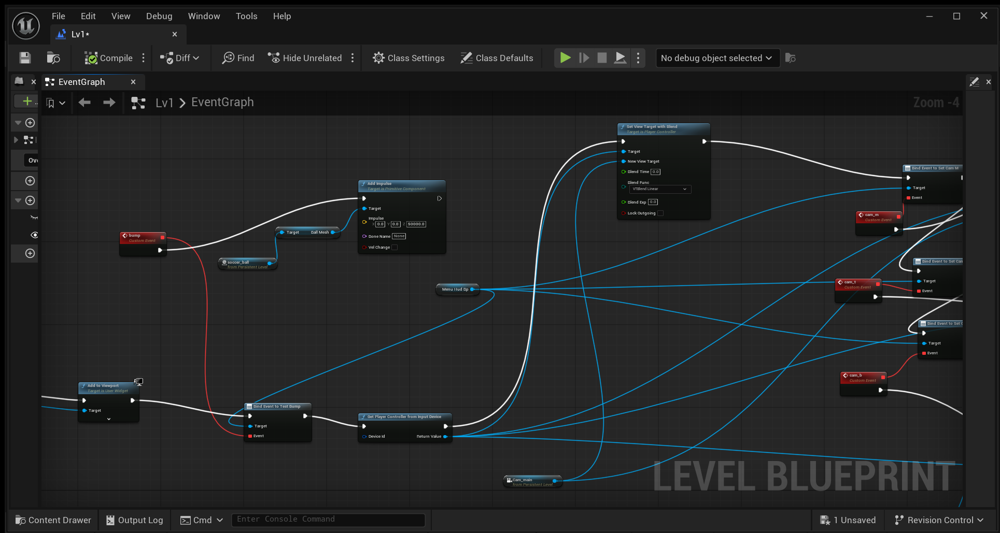
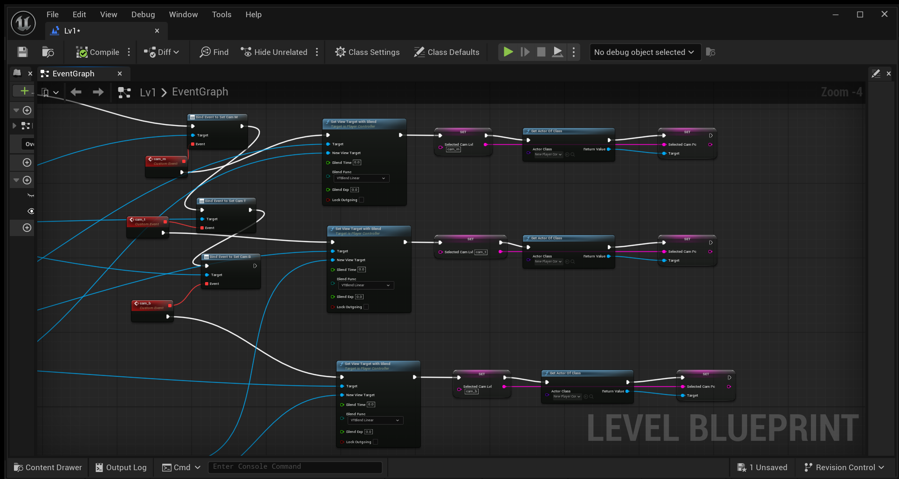
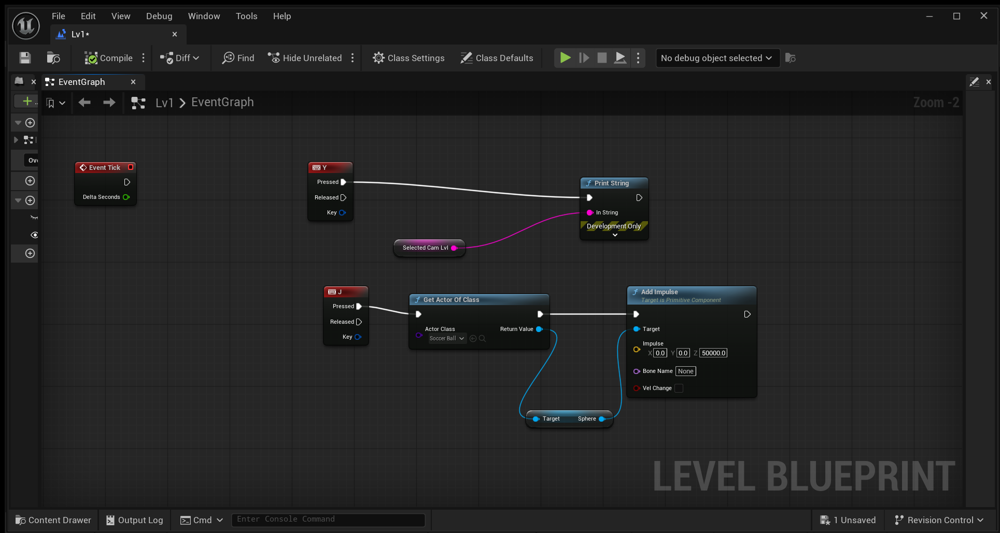
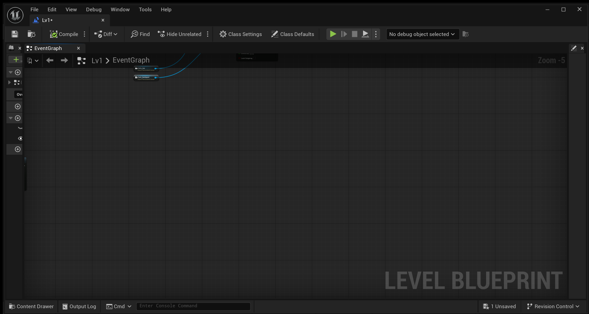
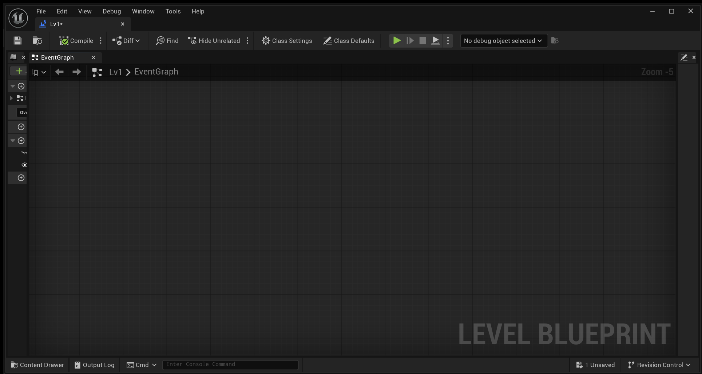
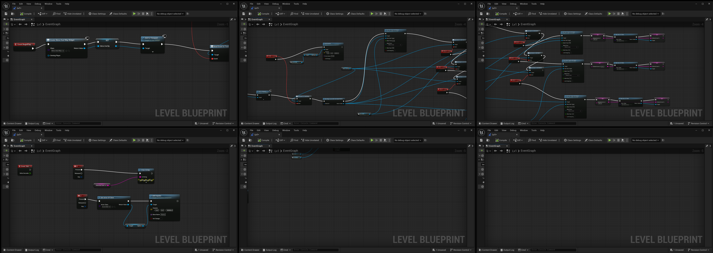

### 🎮 Blueprint Screenshot Capture & Stitcher

A lightweight desktop tool for capturing high-quality Unreal Engine Blueprint screenshots and stitching them into a single large image — without zooming out or losing node detail.

Designed for developers who want readable, documentation-friendly Blueprint graphs.

✨ Features

Capture high-resolution Blueprint screenshots at any zoom level

Manual, user-controlled capture (no auto-panning or automation)

Sequential screenshot capture (tile_01.png, tile_02.png, …)

Stitch screenshots into one large image

Packaged as a standalone Windows executable

### 🧠 Motivation

Large Blueprint graphs in Unreal Engine quickly become unreadable when zoomed out.
Standard screenshots are limited to screen resolution and lose detail.

This tool allows you to:

Capture multiple readable screenshots at full zoom and stitch them into a single, detailed image suitable for documentation, tutorials, and archiving.

### 🚀 Usage Workflow

Open Unreal Engine and the Blueprint graph you want to capture

Set a zoom level where node text is clearly readable

Launch the app

Select a folder to store screenshots

Set the number of columns and rows for your capture grid

For each tile:

Pan the Blueprint graph manually

Click Capture next tile

After capturing all tiles, click Stitch

A single stitched PNG image will be generated

### 

### 📸 Capture Behavior

The application does not control Unreal Engine

No mouse or keyboard automation

You manually move the Blueprint graph between captures

Each capture:

Minimizes the app window

Screenshots the Unreal Editor window

Saves the image sequentially to the selected folder

This approach prioritizes stability, predictability, and image quality.

### 📸 Screenshots

#### Main Window 

#### Full blueprint example

#### tile_01

#### tile_02

#### tile_03

#### tile_04

#### tile_05

#### tile_06

#### stitched screenshots 

### 

### 📦 Project Structure

blueprint_capture_stitcher/
├─ main.py
├─ ui.py
├─ stitcher.py
├─ capture_window.py
├─ requirements.txt
├─ blueprint_icon.ico
└─ README.md

### 🛠️ Running from Source

Install dependencies
pip install -r requirements.txt

Launch the app
python main.py

### 🧱 Building the Standalone Executable (Windows)

pip install pyinstaller
pyinstaller --onefile --windowed --icon=blueprint_icon.ico main.py

The executable will be created in the dist/ folder.

### ⚠️ Current Limitations

Captures the entire Unreal Editor window (not just the Blueprint panel)

Manual panning is required between captures

All screenshots must:

Use the same zoom level

Have the same resolution

Be captured in left-to-right, top-to-bottom order
